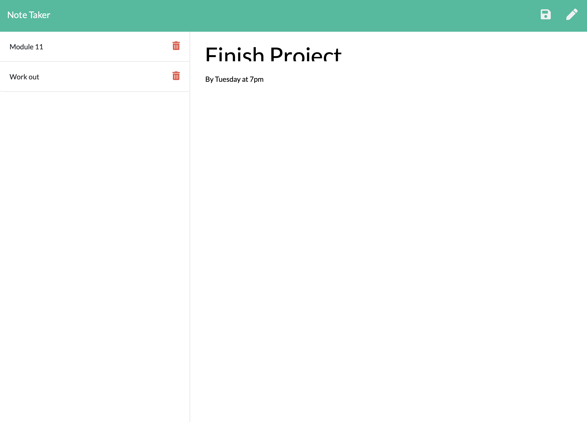

# Note Taker

## Description

A note-taking application that uses the express dependency in node.js. When the user opens the note taker, they are presented with a landing page with alink to a notes page. When the user clicks on the link to the notes page, they are presented with a page with existing notes listed in the left-hand column, plus empty fields to enter a new note title and the note’s text in the right-hand column. When the user enters a new note title and the note’s text, a save icon appears in the navigation at the top of the page. When the user clicks on the Save icon, the new note they have entered is saved and appears in the left-hand column with the other existing notes. When the user clicks on an existing note in the list in the left-hand column, that note appears in the right-hand column. When the user clicks on the Write icon in the navigation at the top of the page, they are presented with empty fields to enter a new note title and the note’s text in the right-hand column.

## Built With
* node.js
* express

## Installation

In order to use this program, the express dependency must be installed. 

## License
This project is covered by ISC.

## Screenshot
 
 

## Contribution
Mallory Korpics (https://github.com/mallynnk)

